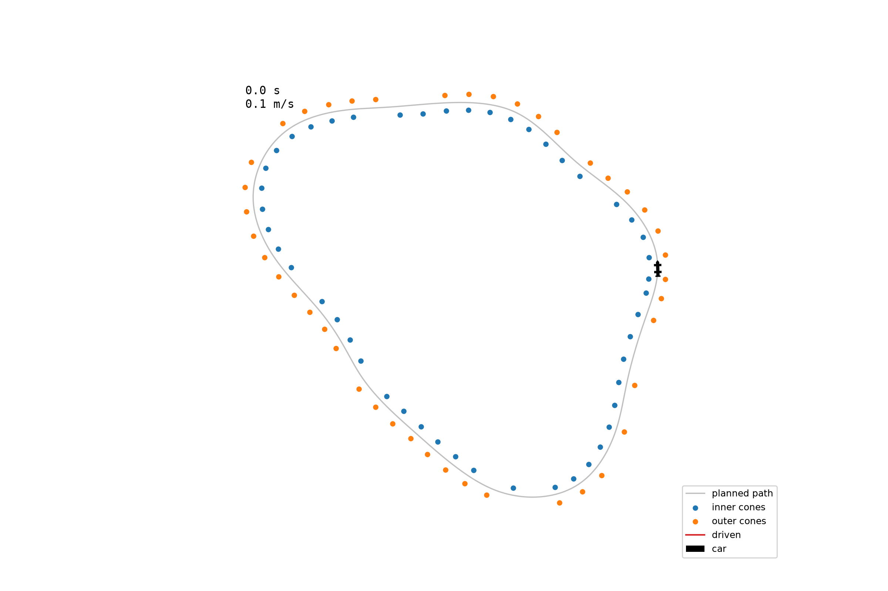

# Cone Track Path Simulator

Recovers a driveable racing line from unordered, noisy cone positions and simulates a vehicle on it

## Problem
Formula SAE driverless requires the vehicle to be operated autonomously on a course marked by colored cones, blue on one side and yellow on the other. The layout is not known to the car in advance, so it must build a driveable centerline line in real time from cone positions and then track it.

This project recovers the centerline and tracks it on synthetic cone data, with perception assumed. Cone data is unordered, noisy, and some cones are missing to simulate data inaccuracy during real races. 

## Pipeline

`track.py` -> Track generation: builds a closed-loop centerline as a sum of sinusoidal harmonics in polar form, resamples it at a uniform arc length (5.0 m), and places blue and yellow cones 1.75 meters on each side along the normal. The output is then corrupted to mimic imperfect perception: 5 cm Gaussian position noise, 7% cones missed, and shuffled so that cones are unordered. The true centerline is saved for evaluation purposes (never given to the path builder).  

`centerline.py` -> Centerline recovery: Runs Delaunay triangulation over all the cones and extracts the unique edges. We then apply a filter -> only blue-yellow edges are kept (same color edges run along the boundary). Edges over 8.0 m are also rejected (caused by deleted cones) so that the line is not skewed by outliers (see `edgelengths.png` and `midpoints_no_outliers.png` vs `midpoints_w_outliers.png`). After we take the midpoints of these remaining edges and order them with a greedy nearest-neighbor starting from the car's start position. 

`path.py` -> Path fitting + speed profile: We fit a periodic cubic spline through the ordered midpoints with a smoothing constant `s = 1.0`. Then the spline is resampled to 3000 points at a uniform arc length. Curvature is calculated from the spline's first and second derivatives, and it's then used to build a speed profile over the 3000 points with the speed capped at `sqrt(a_lat/|κ|)` at every point. A backward pass applies braking limits and a forward pass on the profile applies the acceleration limits. Each pass is done twice to take care of the seam (end and start of the loop).

`sim.py` -> Vehicle simulation: a kinematic bicycle model with a 1.55 m wheelbase is simulated in 0.02 second steps over the path returned by `path.py`. Steering comes from pure pursuit: the controller aims at a point on the path a lookahead distance away. This distance scales with speed, and the steering angle is clamped to ±25°. The car accelerates or brakes in proportion to how far it is from the speed profile's target, clamped by the acceleration and braking limits used to build the profile. All states are recorded and are used to construct the animation and the cross-track error measurement. 

## Findings

**Edge-length filtering removes outliers without affecting median accuracy**
 Blue - yellow edge lengths are bimodal, with straight edges across the track clustered at the track width (3.5 m) and diagonal edges from cone *i* to cone *i* + 1 at √(width² + spacing²) ≈ 6.1 m. However, there are some outliers where a dropped cone forces Delaunay to bridge a large gap which produces midpoints far off the centerline. 
hello

## Limitations

## Next Steps

## References

