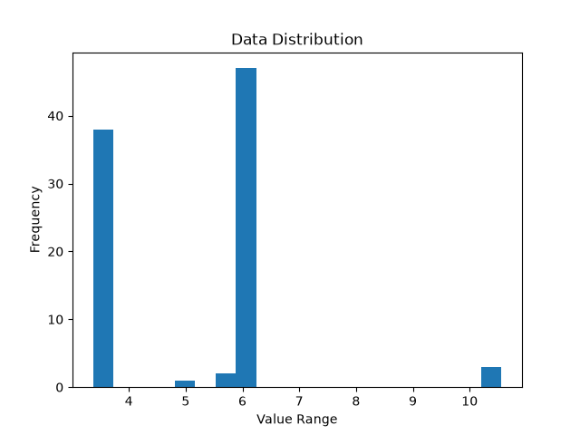

#notes
references:

delaunays triangualtion:

Delaunay, Boris (1934). "Sur la sphère vide" [On the empty sphere]. Bulletin de l'Académie des Sciences de l'URSS, Classe des Sciences Mathématiques et Naturelles (in French). 6: 793–800.

lawsons flip algorithm:
https://www.cise.ufl.edu/~ungor/delaunay/delaunay/node5.html

simple implentation of track finding between blue and yellow in matlab:
https://blogs.mathworks.com/student-lounge/2022/10/03/path-planning-for-formula-student-driverless-cars-using-delaunay-triangulation/

what is delaunay triangles?
-> way to connect dots with triangles that give you "nice" and "well behaving" triangles rather than skinny slivers
if two triangles are not meeting the delaunay criterion, "flip" it by taking the erasing shared edge and constructing two triangles on the alternate shared edge

lawson's flip algorithm:
take any valid triangulation, look at every edge (line between ),
check if it passes the empty circle test
if the test fails, flip the edge
repeat until no edge fails

its proven that this will always terminate and you wont be stuck in a loop going back and forth flipping the same edges
n^2 flips is worst case

side note: can only flip if the quadrilateral (formed by 2 triangles) if its convex, but good for us every concave doesnt fail the test so we dont have to flip it anyways

algorithm:
1. create delaunay triangulation
2. remove exterior triangles
3. find midpoints of interior edges
4. interpolate these midpoints to create a line
5. bonus: model what the line would look like if we took a random triangulation vs delaunays to observe the difference (if any)

track.py -> generate a track, deformed circle with blue cones on inside and yellow cones on outside, with positional noise and shuffled array to simulate real data

centerline.py -> delaunay on cones, keep blue to yellow edges, order their midpoints by greedily connecting them 

path.py -> create a periodic spline over the midpoints, curvature, speed profile

Removing long edge outliers which would throw off the midpoint ->

First cluster for straight ith blue cone to ith yellow cone
Second cluster for i+1th cone to ith cone (diagonals)
Third cluster for outliers where cones are missed causing a large edge length which will lead to the midpoints missing the truth line

Removing the third cluster outliers will reduce offset from truth but larger gaps on curved roads can make interpolation worse

-> Test error between no filter, removing, and downweighting outliters

Edge-length filtering: Cross edges above 8.0 meters are removed. On 50 generated tracks (5,055 cross edges), this removes 0.73% of midpoints. Average accuracy is unchanged: median per-track mean offset 0.0825 m -> 0.0810, p95 0.0191 m -> p95 0.0190 m. However, the right tail is significantly reduced: p90 of per-track maximum offset reduces from 0.585 m to 0.329 m, and the number of tracks containing a midpoint of an offset of 0.5 m or higher falls from 11 to 0 tracks. The filter activates on 24 out of 50 tracks and lowers the maximum on 16 of those. On those 16, median maximum falls 0.565 m -> 0.243 m. 

greedy algorithm in centerline needs a radius of 20 meters for 0 failiures over 1000 seeds

SEED = 1

        Smooth Values compared (offset comparison -> higher number is WORSE):

       0  mean 0.1039  p95 0.2853  max 0.7524
       1  mean 0.1257  p95 0.3168  max 0.4866
       5  mean 0.2066  p95 0.4739  max 0.5310
      20  mean 0.3839  p95 1.0853  max 1.2202
      50  mean 0.5257  p95 1.2084  max 1.5266
     100  mean 0.8471  p95 1.5593  max 1.8375
     200  mean 1.2001  p95 2.3303  max 2.7235

        Outlier filter on vs off test (removing midpoints where edge_length is greater than ~8.0):

FILTER OFF:
       0  mean 0.1039  p95 0.2853  max 0.7524
       1  mean 0.1257  p95 0.3168  max 0.4866
       5  mean 0.2066  p95 0.4739  max 0.5310
      20  mean 0.3839  p95 1.0853  max 1.2202
      50  mean 0.5257  p95 1.2084  max 1.5266
     100  mean 0.8471  p95 1.5593  max 1.8375
     200  mean 1.2001  p95 2.3303  max 2.7235
FILTER ON:
      0  mean 0.0828  p95 0.2137  max 0.3761
       1  mean 0.1123  p95 0.2608  max 0.3215
       5  mean 0.2195  p95 0.5204  max 0.6461
      20  mean 0.4423  p95 0.8981  max 1.0179
      50  mean 0.6563  p95 1.3990  max 1.6485
     100  mean 0.9158  p95 1.9390  max 2.4301
     200  mean 1.2620  p95 2.3769  max 2.5677

At low smoothing values (0 to 1), filter on seems to improve accuracy across mean, 95th percentile and maximum
At higher smoothin values (200), filter decreases accuracy across mean and 95th percentile but produces a lower max offset

Best combination seems to be: Smoothing 1 with filter on

Seems consistent throughout multiple seeds as well

Spline-to-truth max 0.32 m; driven-to-truth max 0.59 m. the controller contributes roughly 0.27 m of corner-cutting on top of the path's own deviation from truth

following the curvature speed profile rather than the constant 8.0 m/s set, decreased lap time from 34.9s to 30.6s but increased maximum cross track error from 0.59 to 0.69 (17% increase). still well under 1.75m track width limit.